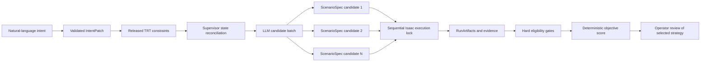

# System Improvement and Experiment Specification

## 1. Scope and research claims

This document defines the implemented system boundary and the protocol that must
be used when the experimental campaign is rerun. It deliberately separates
capabilities that are implemented from claims that require new measured results.

The improved control loop is:

1. Parse an operator's natural-language request.
2. Validate required fields, supported values, and target scope.
3. Release the operator-approved Task Requirement Table (TRT) constraints.
4. Reconcile the released TRT with current state records.
5. Ask the LLM for multiple constrained candidate execution strategies.
6. Generate one ScenarioSpec for each candidate.
7. Run every candidate through Isaac Sim, strictly one candidate at a time.
8. Extract deterministic RunArtifact evidence for every candidate.
9. Exclude candidates that fail mandatory safety or data-completeness gates.
10. Rank the remaining candidates with a declared objective function.
11. Present the selected candidate and the full comparison to the operator.
12. Permit deployment review only for the selected ScenarioSpec and RunArtifact.

The LLM proposes alternatives but does not judge feasibility and does not select
the winner. Selection is performed by deterministic code using stored evidence.
Candidate output is schema-validated and must contain the requested number of
behaviorally distinct alternatives. Invalid output is regenerated up to three
times by default with the deterministic validation error included as feedback;
if every attempt fails, the batch stops explicitly and no simulation is started.



## 2. Candidate strategy contract

Candidate generation is implemented in
`trt_core/strategy_selection.py`. The JSON output must validate against
`schemas/candidate_strategy_batch.schema.json`.
The generation context contains the released TRT, supervisor reconciliation
decisions, the aligned current state record for each registered TRT line, and
the persisted Time-Arrival state. That input snapshot is retained in the
strategy-batch record for auditability.

The LLM may vary only:

- Per-line `manipulator_priority`.
- Per-line `abnormal_strategy`.
- `chosen_intervention_mode` when the operator did not lock that value.

The LLM may not vary:

- Operator-selected production lines.
- KPI targets.
- Tooling targets and exclusions.
- Task goals.
- Explicitly requested Time-Arrival values.
- Scene topology, line registry, seeds, collision tolerances, or infrastructure
  paths.

This boundary prevents the optimizer from obtaining a better score by changing
the problem being evaluated. The candidate generator reads the approved release
record and deterministically locks any `manipulator_priority` or
`abnormal_strategy` field changed by that IntentPatch. Candidate distinctness is
computed from effective policy behavior, not from superficial differences in
the override JSON.

### 2.1 Selection objective

The objective is stored in
`data/strategy_selection/default_objective.json`. A candidate is ineligible if:

- The RunArtifact is not finalized.
- Evidence does not allow deployment.
- Placement verification evidence is absent or any placement fails.
- Reset-cycle evidence is absent or any required reset cycle is incomplete.
- A required tooling-priority rule is violated.
- Batch-gating behavior is violated.
- Throughput evidence is absent.
- Any individual production line's actual throughput is below its own target.

Eligible candidates receive:

```text
score = throughput_attainment
```

`throughput_attainment` is the mean actual-to-target throughput ratio across
simulated lines and is not capped at 1.0. `R_storage`, `R_reset`, priority
compliance, and batch-gating compliance are safety or completion gates, not
tradeable objective terms. The mean ratio ranks only candidates that pass the
per-line throughput gate; overperformance on one line cannot offset a miss on
another. Ties are resolved by lower strategy simulation time,
then candidate ID. All exclusions, measurements, scores, and ranks are persisted.

The LLM is not called again merely because Isaac evidence makes a candidate
ineligible. If no candidate is eligible, the batch records evidence-derived
refinement suggestions and returns control to the operator. LLM regeneration is
bounded to pre-simulation candidate-output failures such as malformed JSON,
schema violations, changed locked constraints, or non-distinct alternatives.

## 3. Test environment

### 3.1 Software and execution services

| Layer | Implemented role | Evidence source | Principal limitation |
| --- | --- | --- | --- |
| n8n | Operator chat, session routing, approvals, orchestration | Workflow execution JSON and session state | A checked-in workflow change is not active until imported and published |
| `trt-api` | Validation, persistence, reconciliation, candidate generation, ScenarioSpec generation, evidence, ranking | API responses and repository JSON | File-backed persistence and in-process background worker |
| vLLM endpoints | Dialogue extraction, formatting, candidate proposals | Raw request/response and token usage | Server sampling presets and GPU memory are not reported by default |
| Isaac host runner | Executes ScenarioSpecs | Host request, result database, RunArtifact | Long startup and execution times; only one candidate may run at a time |
| M12 tools | Collection, scoring, comparison, reporting | SQLite, CSV, JSONL, manifests | Results are valid only when provenance identifies live or historical evidence |

### 3.2 Current digital-twin defaults

The deployed default record currently defines:

| Parameter | Value |
| --- | ---: |
| `headless` | `false` |
| `global_seed` | `65` when supplied by the host configuration |
| `max_seed_trials` | `1` as host infrastructure, not operator policy |
| `reuse_precomputed_layouts` | enabled as host infrastructure |
| `layout_source` | `auto` |
| `episode_success_requires_reset_cycles` | `1` |
| `allowed_overlap_ratio` | `0.99` |
| `chosen_intervention_mode` | `immediate-stop` |
| `travel_time` | `1.0 s` |
| `fix_duration` | `3.0 s` |
| `resume_delay` | `1.0 s` |
| `add_reference_number` | `5` |

The three Time-Arrival values are now persisted separately in
`data/state_records/time_arrival_model.json`. Intent prompts and deterministic
post-processing read that state record before interpreting relative changes.

## 4. Workstation specification

The line registry contains four production-line workstations. Each is an
independent instance of the same surgical-tooling sorting-cell task.

| Workstation | Function | Input | Task | Output | Major limitations |
| --- | --- | --- | --- | --- | --- |
| `line_1`, `workspace_line_1`, `ur5_line_1` | Surgical-tooling classification and placement | A table batch of tool instances plus line policy | Classify, pick, and place required tools into the required tray and unwanted tools into the unwanted box | Tool events, placement records, timing, throughput, reset evidence | Registry says physical/digital-twin capable, but this repository has no verified physical actuation adapter |
| `line_2`, `workspace_line_2`, `ur5_line_2` | Same sorting function with an independently configurable policy | Same data type as line 1, potentially different target set or priority | Same task family as line 1 | Independent line KPI and event records | Same limitation as line 1 |
| `line_3`, `workspace_line_3`, `ur5_line_3` | Logical/digital-twin sorting cell | Simulated tool batch and line policy | Same task family as lines 1 and 2 | Simulated KPI and event records | Registry marks `physical_available=false`; no physical validation claim is permitted |
| `line_4`, `workspace_line_4`, `ur5_line_4` | Logical/digital-twin sorting cell | Simulated tool batch and line policy | Same task family as lines 1 and 2 | Simulated KPI and event records | Registry marks `physical_available=false`; no physical validation claim is permitted |

The production line is the policy and KPI scope. A workstation binds that line
to an environment, robot, workspace, tray, input area, output area, and camera.
Equipment performs the task defined by the line policy.

Current substitution and scheduling limits:

- Workstations perform the same task family but may use different tooling
  targets, KPI limits, and pick priorities.
- Tool-pick ordering is configurable within a workstation.
- A task cannot currently migrate from one workstation to another during a run.
- The system does not currently solve job-shop scheduling, resource allocation,
  or cross-line task reassignment.
- Line order is not optimized.
- Candidate comparison concerns execution policies for a fixed operator request,
  not production scheduling.

## 5. Research questions and case studies

The experimental checkpoints answer these research questions:

- **RQ1:** Can natural language be converted into semantically correct,
  schema-valid production requirements?
- **RQ2:** Can the evidence/query pipeline select and order the required tools
  without fabricating data?
- **RQ3:** Can multiple execution strategies be physically checked and ranked
  from stored digital-twin evidence?
- **RQ4:** Can unsafe, invalid, or unsupported states be stopped before
  deployment?
- **RQ5:** What latency and human-review cost are introduced by the closed loop?
- **RQ6:** How stable is structured generation across repetitions and models?

| Case | Initial conditions | Expected problem | Test objective | Methodology | Expected result |
| --- | --- | --- | --- | --- | --- |
| TC1 Intent-to-plan | Gold natural-language intents include simple, composite, ambiguous, and boundary cases | CP0-CP3 may fail through wrong routing, missing fields, wrong scope, or schema/semantic drift | Validate RQ1 | Send each original natural-language input, compare candidate patch and ScenarioSpec with immutable gold fields | Supported requests preserve meaning; ambiguous requests clarify; invalid specifications do not reach simulation |
| TC2 Tool orchestration | 25 L1, 25 L2, and 25 L3 queries with fixed tool sequences | Wrong source, argument, dependency order, or fabricated answer | Validate RQ2 | Capture backend route/function trace and compare it with the fixed sequence; separately judge answer correctness | Correct tool set, arguments, order, and source-backed answer |
| TC3 Candidate and KPI study | Four scenario families with repeated runs and at least two candidates per accepted request | Candidate may be unexecutable or fail KPI, placement, reset, priority, or batch checks | Validate RQ3 and part of RQ5 | Generate a candidate batch, simulate all candidates sequentially, apply hard gates, rank eligible candidates | Every candidate has a ScenarioSpec and RunArtifact; only an eligible winner is offered for review |
| TC4 Error interception | Stage-specific error injections with expected interceptors | Error may escape its intended guardrail | Validate RQ4 | Inject the stated error, retain the natural-language starting point, and run only to the relevant stage | Safety-critical errors never reach deployment; clarification or operator refusal before deployment counts as interception when supported by transcript evidence |
| TC5 Closed-loop timing | Accepted requests with recorded lifecycle events | Long or unobservable waiting and review periods | Validate RQ5 | Record all lifecycle timestamps and detailed timing phases | Complete timing decomposition or explicit `DATA_INCOMPLETE` fields |
| LLM repetition/model study | Same prompt, schema, and fixtures across Gemma, Qwen, and Llama | Format, completeness, meaning, and latency may vary | Validate RQ6 | Repeat each request per model with server presets untouched | Per-model stability, accuracy, token, and latency results with missing hardware data labeled |

The expected failure step must be declared before execution. It must not be
inferred after seeing an inconvenient result.

## 6. Checkpoint protocol

| Checkpoint | Test object | Pass criteria | Failure reasons | Automated/manual | Metrics |
| --- | --- | --- | --- | --- | --- |
| CP0 | Operator-input validity | Supported task/query or a valid clarification path | Unclear input, nonsensical numerical scope | Automated with manual audit | Input validity rate |
| CP1 | Intent and required fields | Correct route and complete route-specific fields | Misclassification, missing operator/reason/scope | Automated with manual audit | Classification accuracy, completeness rate |
| CP2 | JSON and schema | Parseable JSON and valid schema | Truncation, invalid type, unknown field, enum/range error | Automated | JSON accuracy, schema compliance |
| CP3 | Semantic correctness | Lines, tasks, equipment, values, and ordering match expected meaning | Scope drift, time-semantic mismatch, omitted device mapping, priority error | Automated plus manual review | Semantic accuracy |
| CP4 | Digital-twin executability | Scenario compiles and produces finalized RunArtifact | Scenario, collision, object, host, or simulator failure | Automated | Execution success rate |
| CP5 | KPI and constraints | Mandatory evidence exists and all hard gates pass | KPI, placement, reset, priority, batch, or evidence failure | Automated | KPI compliance and individual evidence rates |
| CP6 | Human review | Operator accepts without correcting generated content | Manual rejection or correction request | Manual | Autonomous and assisted outcome rates |

Checkpoint denominators must be stage-specific. For example, CP4 execution rate
uses only cases that entered CP4, while input validity uses all submitted cases.

## 7. Outcome classes

Exactly one terminal outcome is assigned:

| Outcome | Definition |
| --- | --- |
| `AUTONOMOUS_SUCCESS` | CP0-CP5 pass and no human correction was needed; operator acceptance, when required, did not alter the generated strategy |
| `MANUALLY_ASSISTED_SUCCESS` | The case ultimately completed after an operator or engineer corrected an input, configuration, or recoverable issue |
| `VALIDATION_FAILURE` | CP3 or CP5 failed because the specification, policy, KPI, or evidence was unacceptable |
| `INPUT_FAILURE` | CP0-CP2 could not produce a valid supported specification |
| `SIMULATION_FAILURE` | CP4 failed because ScenarioSpec/Isaac execution did not complete |
| `SYSTEM_ERROR` | API, program, database, environment, transport, or unclassified internal error |
| `MANUAL_REJECTION` | The result was executable, but the operator declined it |
| `EVALUATION_INCOMPLETE` | Available records do not establish every checkpoint needed for a terminal outcome; missing evidence remains null rather than being treated as success or system failure |

Clarification is not automatically a failure. A clarification followed by a
corrected completion is `MANUALLY_ASSISTED_SUCCESS`. A clarification that the
operator abandons remains an `INPUT_FAILURE`. An operator refusing suspicious
evidence is `MANUAL_REJECTION` and is also a successful safety interception when
the deployment was prevented.

## 8. Metrics and formulas

```text
Autonomous Success Rate =
  autonomous successes / all submitted cases

Assisted Completion Rate =
  assisted successes / cases that required human intervention

Overall Completion Rate =
  ultimately completed cases / all submitted cases

Automated Pass Rate =
  automated PASS cases / automated test cases

Manual Verification Pass Rate =
  manual PASS cases / manually reviewed cases

Auto-Human Agreement Rate =
  matching automated/manual decisions / manually reviewed cases
```

Automated and manual results must remain separate columns. Reports must list:

- Automated PASS and manual FAIL cases.
- Automated FAIL and manual PASS cases.
- The reason for disagreement.
- Whether the mismatch arose from keyword, formatting, trace visibility, or
  semantic interpretation.

`tools/m12_record_semantic_review.py` records a case-by-case review against the
captured execution, ScenarioSpec, RunArtifact, and gold expectation. A Codex
review is labelled `CODEX_SEMANTIC_REVIEW`; it is independent of the packet
scorer but is not misrepresented as operator review. Only an
`OPERATOR_REVIEW` record supplies CP6.

`Overall Compliance Pass Rate` means:

```text
cases passing every declared mandatory criterion
/
cases entering the compliance evaluation stage
```

The mandatory set is: required fields complete, schema valid, line valid, task
valid, values in range, simulation finalized, mandatory placement
evidence present, KPI constraints passed, automated checks passed, and manual
review passed when CP6 applies.

The report must provide at least input validity, intent classification,
required-field completeness, schema compliance, semantic accuracy, digital-twin
execution, KPI compliance, automated pass, manual pass, and final completion
rates.

## 9. Before and after digital-twin metrics

Before-digital-twin results contain only CP0-CP3:

- Intent classification accuracy.
- Required-field completeness.
- JSON/schema validity.
- Syntax and formatting accuracy.
- Reasonableness and semantic correctness of task descriptions.

After-digital-twin results contain CP4-CP6:

- Scenario executability.
- Collision/interference and placement evidence.
- KPI compliance.
- Task/reset completion.
- Candidate ranking.
- Manual review.

A language-only baseline must not be compared against a post-simulation KPI as
if they measure the same construct.

## 10. Timing protocol

Each candidate/run record should contain:

| Timing field | Start | End | Included in strategy validation time |
| --- | --- | --- | --- |
| `llm_generation_seconds` | Request sent to model | Complete structured response received | No |
| `specification_parsing_seconds` | Structured response received | Schema and semantic validation complete | Yes |
| `environment_wait_seconds` | Candidate queued | Isaac worker lock acquired | No |
| `simulation_startup_seconds` | Host launch begins | Scene ready/start event | No |
| `reset_seconds` | Reset begins | Required reset completes | Report separately |
| `strategy_simulation_seconds` | Strategy evaluation begins after startup | Strategy terminal event | Yes |
| `kpi_calculation_seconds` | RunArtifact readable | KPI extraction complete | Yes |
| `automated_verification_seconds` | Evidence checks begin | Checks and objective score complete | Yes |
| `manual_review_seconds` | Review shown | Operator decision | No |
| `end_to_end_seconds` | Intent first received | Final review ends | Whole loop only |

Actual strategy validation time is:

```text
specification parsing
+ strategy simulation
+ KPI calculation
+ automated verification
```

It excludes queueing, Isaac launch, unrelated model loading, rendering,
recording, and unrelated initialization. If the host runner does not expose a
scene-ready timestamp, `T_verification_seconds` must remain null and the row must
say `DATA_INCOMPLETE`; it must not estimate a split. The raw
`T_verification_wall_seconds` remains available for audit. The startup boundary
is the last configured articulation/GPU startup warning, captured with a host
system timestamp or, explicitly as fallback, an Isaac internal timestamp.

## 11. Failure taxonomy

| Failure case | Failure stage | Failure source | Automated check result | Manual result | Rejection reason | Correction method |
| --- | --- | --- | --- | --- | --- | --- |
| Unclear operator input | CP0 | Operator/communication | Clarification | Review whether clarification is reasonable | Meaning or scope is indeterminate | Provide one missing fact |
| Incorrect intent classification | CP1 | LLM/router | FAIL | Confirm correct route | Query/change/decision misrouted | Revise prompt or deterministic route |
| Required-field omission | CP1 | Operator or extractor | Clarification/FAIL | Confirm field was truly required | Required field absent | Supply field or correct requirement map |
| JSON/schema error | CP2 | LLM/transport | FAIL | Verify raw output | Invalid JSON/type/enum/range | Retry or reject; never repair silently |
| Target-device conversion omission | CP3 | Extractor/normalizer | FAIL | Compare expected device | Named target was not normalized | Add verified alias/mapping |
| Time-semantic mismatch | CP3 | LLM/normalizer/state | FAIL | Compare state baseline and wording | Relative change used wrong baseline/direction | Align state and regenerate |
| Priority rule not enforced | CP3/CP5 | Strategy or simulator | FAIL | Inspect tool order | Required ordering omitted or violated | Revise strategy |
| Invalid line not intercepted | CP1/CP3 | Validator | FAIL only if the requested line is invalid for the declared registry | Inspect registry and requested experiment | Registry/scope contract violated | Fix registry or reject request |
| Query/change route confusion | CP1 | Dialogue router | FAIL | Review actual question | Read-only question created a patch | Correct routing prompt/rules |
| Numeric range insufficient | CP1/CP3 | Schema/validator | FAIL only for a declared nonsensical or unsafe value | Inspect domain bound | Value violates explicit bound | Clarify/reject or revise bound |
| Policy infeasible | CP5 | Candidate policy | FAIL | Review evidence | Hard KPI/safety gate failed | Generate a new candidate batch |
| Digital-twin scenario issue | CP4 | Scenario/scene | FAIL | Distinguish policy from environment | Collision/object/binding problem | Correct ScenarioSpec or environment |
| Simulator/API error | CP4/system | Infrastructure | FAIL | Confirm logs | Host/API/DB/transport failure | Repair system, then rerun same case |
| Automated false positive | Any | Test scorer | Automated PASS | Manual FAIL | Keyword/trace rule accepted wrong semantics | Correct scorer and preserve disagreement |
| Manual rejection | CP6 | Operator | Automated may PASS | Manual REJECT | Evidence executable but unacceptable | Record reason; do not relabel autonomous |

`line_99` and a high throughput target are not inherently invalid. Their outcome
depends on the declared experiment contract. If a test intends dynamic
99-line-table generation, failure requires evidence that the table was not
generated correctly. A genuinely nonsensical case, such as negative line count,
must be identified explicitly.

## 12. LLM generation stability and model comparison

Run:

```bash
python -m tools.llm_generation_benchmark \
  --input outputs/reports/m12/seed_data/operator_intent_gold.jsonl \
  --repetitions 5 \
  --output outputs/reports/llm_comparison
```

The benchmark compares:

- `cyankiwi/gemma-4-26B-A4B-it-AWQ-8bit`
- `Qwen/Qwen3.6-35B-A3B-FP8`
- `meta-llama/Llama-3.1-8B-Instruct`

Every model receives the same prompt version, schema, and input. The client does
not send `temperature`, `top_p`, `top_k`, `min_p`, `presence_penalty`, or
`repetition_penalty`. Therefore temperature, top-p, and seed are recorded as
null with `SERVER_PRESET_NOT_OVERRIDDEN` unless model-server metadata is
collected separately. Null is required; guessed server settings are forbidden.

Recorded outcomes include JSON accuracy, required-field completeness, intent
classification accuracy and consistency, semantic accuracy, field-content
consistency, output variants, failure type, average/maximum latency, and token
usage. GPU memory remains `DATA_MISSING` until measured at the model server.

## 13. Deployment and physical-scope limitation

The repository implements a **simulated physical deployment** that updates local
JSON state and digital-twin defaults. It does not contain a verified PLC, ROS 2,
Modbus, robot-controller, or safety-PLC actuation path. Registry metadata saying
`physical_available=true` describes a modeled workstation capability; it is not
proof that this software deployed to real equipment.

The research claim after the next experiment can therefore be:

> Multiple LLM-proposed strategies were compared through a physics-based digital
> twin and an evidence-backed human gate before simulated deployment.

It cannot yet be:

> The selected strategy was deployed to and validated on the physical production
> line.

## 14. Operational activation

The changed workflow keeps the ID `GenerateScenarioSpecDemo`. On 2026-07-29 it
was updated through the n8n API and verified active. Its active node names are:

- `Generate Candidate Strategy Batch`
- `Start Sequential Candidate Simulations`
- `Poll Candidate Strategy Batch`
- `Build Selected Strategy Evidence Response`

No new smoke or full comparison results should be generated until the complete
system-improvement verification is accepted. The workflow activation check is
complete; focused backend verification is recorded with the implementation.

## 15. Implementation verification status

Verification on 2026-07-29 produced:

- `14/14` focused multi-candidate, state-alignment, ranking, deployment-guard,
  checkpoint, review-ledger, and workflow-contract tests passed.
- Python compilation passed.
- All eight checked-in n8n workflow JSON files parsed.
- The live `trt-api` health, strategy-batch routes, and Time-Arrival state route
  were reachable.
- The three active n8n workflows were active and contained none of the six
  prohibited sampling request fields.
- The complete historical repository suite reported `301 passed, 42 failed`.

The 42 complete-suite failures are not concealed as a green build. They are
legacy contract/test-debt clusters, including assertions for the former
single-candidate n8n node topology, the former `5.0/8.0/0.5` Time-Arrival
defaults, the former prefixed ScenarioSpec filename, and unrelated existing
debug/version/context expectations. They must be migrated or fixed before the
repository can claim a fully green regression suite. They do not replace the
required new Smoke/full experimental campaign, which has deliberately not been
started in this implementation phase.
